# Globalbond General Notes

- [*First Florida Limo*](https://firstfloridalimo.com/)

- *meet greet*: Meet and greet, also known as Meet and assist, is an airport service that offers airport greeter, fast track services, access to airport lounges, buggy service, porter service, and more to help travelers avoid lengthy airport queues and forget the difficulties of tedious airport requirements.

- *captain seats*: Captain Seat is a seat made for only one person. This type of seat is usually installed on the second row of seats, separating the right and left passengers. That means there are only two seats in the second or the middle row of the vehicle.

- *bench seats*: A bench seat is a vehicle's version of a sofa or couch. A bench seat is made out of a cushion that spans the whole width of the car. Three persons can sit comfortably on this bench seat cushion. Bench seats are often seen in the back seat of a vehicle with two seating rows (front and rear).

- *forward facing seats*:  forward-facing seats refer to seats in vehicles or other modes of transportation that are positioned to face the front of the vehicle. In the context of car seats or child seats, a forward-facing seat is one that is designed to be installed in a vehicle facing the front.

- Advantages of black car service?
    - personalized service(pick up at the exact time and place)
    - comfort(luxurious vehicles)
    - cleanliness(of vehicles, drivers with professional attires)
    - VIP class of drivers(educated, experienced drivers)
    - perfect service
    - great customer support(bookings with special request)
    - secure(good background check)

- What types of clients are we working with?
    1. *corporate* - secretaries, need flexibility, don't care much about price, so the customer support is imperative(VIP).
    2. *retail* - private trips for themselves and family/friends.
    3. *NEMT*(non-emergent medical transportation)

- Tasks?
  - Calls, emails, messages/chat (cancellations and inquiries), no sales.

---

# Vehicle types

- they have different luggage and passenger capacities:

1. **standard sedan**:
    - 3 passengers / 3 bags(during COVID-19, capacity was 2 - backseats). 
    - *models*:
        1. Cadillac XTS
        2. Cadillac CT5
        3. Chrysler 300
        4. Mercedes(S-class - premium)
        5. Mercedes(E-class - premium)
2. **standard SUV**:
    - up to 6 people and six bags(depends on the capacity of bags).
    - *models*:
        1. GMC Yukon
        2. Chevrolet Suburban
        3. Lincoln Navigator
        4. Ford Expedition
        5. Cadillac Escalade(premium)
3. **van**:
    - has forward facing seats  - standard 13 passengers / 12 bags. There are custom sprinters for custom trips so capacity might vary.
    - *models*:
        1. Mercedes Sprinter
        2. Ford Transit.
        - Note: There is a sprinter limo, looks the same, but instead of forward facing seats has a different/limo seats.

4. *mini-coach*: 18-26 passengers / 18-26 luggage capacity
5. *coach bus*: 54-56 / 50 luggage capacity.
6. *stretch limo*: 7/10 depends on the limo.

- When to use party buses and stretch limos?
    - proms
    - weddings
    - bachelors/bachelorette party

- When deciding which vehicle/the price to select consider?
    - the purpose
    - number of passengers
    - luggage

---

# Drivers

- Types of drivers:
1. house:
    - employed by the company - reliable, flexible, good communication(different languages) - drivers make the highest impression on customers.
    - have different schedules, work in shifts
2. operators:
    - used when house drivers are not available.
    - licensed/have their vehicles
    - have their own clients but also wort together with limo companies.
    - they represent the limo company that dispatched them.
3. affiliated:
    - they are also second choice.
    - it's a company that has own drivers.
    - they are usually more expensive.
    - check review and availability on software the company uses.

- communication:
    - through official software.
    - communication while drivers are with clients in forbidden/unprofessional.
    - polite and professional communication.
    - it's important that the driver is on the way.(check the driver, remind him/her an hour in advance)
    - text to help drivers with location, passenger names.
    - it's important to always know where is the driver.
    - drivers accept rides, they can set their own status in the app, in 50% of cases. When they don't it's necessary to call them.
    - communication should be kept simple.

- software:
    - *Limoanywhere*
    - *Driveranywhere*

- general requirements for the drivers:
    - be ahead of time(15/20 minutes).
    - communication between a driver and a client should be simple(let the client know when he is on location).
    - besides communication, driver opens the door, carries the luggage, helps the client to feel comfortable(newspapers/magazines, bottled water, optimal temperature, etc.), no colones or air fresheners.
    - drivers are not allowed to enter the house.
    - driver shouldn't engage in conversation, focused on driving, familiar with the area.
    - driver according to the traffic rules.
    - driver takes care of the car(washes the car, refuels, etc.)
    - drivers should listen to clients when choosing routes.
    - they are not allowed to take payments, but can accept tips.
    - should let us know if he is going to be late.
    - should let the office know if the driver left something.
    - if the driver can't find location might call to ask.

- depending on the distance between the destination, we should check driver. If the ride is 2 hours long, we should check 3 hours before.

---

# Affiliates

- serious companies with a system, drivers, vehicles.

- use them when rides cannot be covered - house drivers are busy.

- there are many of them and they can be reached out in many ways.

- How to choose affiliate:

1. Check Google reviews - usually the first signal of the attitude.
    - Check working hours.
    - Check the quality of website - if it's outdated, it's a bad sign.
    - Call and ask for *all-inclusive(tax, tolls... - final rate)* affiliate rate, while letting them know that we call on behalf of limo company. - price is based on affiliate price. Point out that driver needs to represent *the company*, not affiliate.
    - price is based on affiliate price, so before giving a price to the client, it's necessary to get the affiliate price.
    - a driver needs to represent the company which dispatched him, he is not allowed to promote the affiliate company in any way.
    - the total price is: affiliate price + markup price.
    - to book affiliate drive we need to provide company's credit card info.
    - send email to affiliate(drive detail, affiliate price).

2. Use *Limoanywhere*:
    - if affiliate uses `Limoanywhere`.
    - Network -> Locate Affiliates -> Country Selection
    - after finding a company go to: view -> establish affiliate relationship.
    - after filtering the results based on requirements, research can be done(website, reviews, etc.)
    - Network requests can be seen in the *Network Request* page.

3. [NLA ride](https://www.nlaride.com/):
    - National Limo Association.
    - most of the firms are NLA members.
    - they are considered reliable.

- *Farm-in(FIN)* - rent a drive to another company
- *Farm-out(FOT)* - rent a drive from another company.

### Farm-out procedure

- in order to send a network request, the company must be in the system of *Limoanywhere*(`My Office -> Company Resources -> Affiliates`: there is a list of affiliates)

- if the company doesn't have *Limoanywhere* use 'Add New Affiliate' section under `My Office -> Company Resources -> Affiliates`

- after finding the drive we want to farm out:
1. set the FOT cost.
2. the name of affiliate.
3. select button farm-out.
4. if affiliate uses *Limoanywhere*:
    1. select *LA NET*.
    2. fill in the information about the affiliate and trip.
    3. choose vehicle type.
    4. press complete to send the reservation.
    5. affiliate should accept the drive.
5. if affiliate doesn't use *Limoanywhere*:
    1. choose the affiliate(always check if the affiliate has *Limoanywhere*)
    2. Use the button manually.
    3. Send a message asking them if they will accept the job.

- How to check if a drive is farmed out?
    - The first indicator is FOT Type on Dispatch page.
    - inhouse rides will have INH Type on Dispatch page.
    - farmed in rides fill have FIN Type on Dispatch page.
    - when the details are check it can be confirmed, the important information is reference number.
    - driver should update the status of the ride, so we should check with the driver.
    - driver's contact information are also available.
    - check the driver just-in-case, there should be communication.
    - it can be seen if the ride was farmed out using *LA Net* or *Manual*.

- if the company uses *Limoanywhere* we will be able to see the statuses of the FOT rides.

### Affiliate Work

- keep an eye on the drivers/rides/statuses.

- if necessary reach to the driver to check the status if something is strange.

- manual *FOT* is more tricky, because without limoanywhere it's harder to follow what is going on.

---

# Service Types

- services:
1. hourly
2. point-to-point

### Hourly Service

- **important terms**:
    - road show
    - hour service
    - garage-to-garage

- What is *garage to garage* principle?
    - The hours start when the driver leaves the base until it returns the base.
    - It's important to let the client know what it means.

- What is *hourly service*?
    - hour service is important when there are multiple stops with more than 20 minutes wait time. We don't charge stop that are maid, while transfers are paid per stop.
    - a driver is at disposal.
    - there is an hourly minimals(3/4 hour minimum SUV, VANS 4 hour minimum, etc.).
    - typical for events(weddings, nights out, etc.).
    - service starts when the client leaves the base and until it leaves, garage-to-garage.

- What is *road show*?
    - usually used by corporate clients who need to visit a lot of places.
    - sight seeing.

- What is *as directed* service?
    - it's when a client just wants to ride around the city.

### Point to point service(door to door)

#### One way

- it's direct one way transport, there is a *pick up* location and *drop off* location.

- it's a common type of service.

#### Round Trip

- it's the transportation to the destination and back.

- common type of service.

#### Airport Service

- it's separated because of it's complexity.

##### From Airport Service

- get flight info(airline company and flight number) - the flights need to be monitored(using different software *flightaware*).

- the driver needs to be there regardless of the flight delay.

- clients often don't have the flight number so based on, the name of an airline, departure location, departure time, and destination, the flight number can be researched.

- we need to know when the flight is at gate - for domestic flights client has 30 minutes free-of-charge since the plane is at the gate, 60 minutes for international flights.

- driver needs to be at location before

- the client has two options to meet the driver:
    1. *curb side pickup(free-of-charge)*
        - client needs to bring the luggage where the driver is parked(driver is supposed to help client navigate). - driver needs to have a board name(board sign).
    2. *meet and greet*
        - clients can hire driver to help them get the luggage, escort them to the vehicle, etc.  - driver needs to have a name sign.
        - greeter can he hired if the airport doesn't allow drivers to leave vehicles unattended.

##### To Airport Service

- check if the flight is domestic(2 hours before the departure) or international(3 hours before the departure).

- it's not necessary to follow the status of these flights.

#### Private Jet Aviation Service

- flight info is necessary(tail number).

- *FBO* - private aviation.

- they are often confidential and cannot be traced.

- driver waits for the client at the piste.

- they use international and smaller/local airports.

- can be from and to airport.

- *Signature Flight Support* - a company that provides such services.

- drivers should be around 20 minutes before the departure.  

#### Pick ups/drop offs from train station

- get the train number

- *mtracksite* can be used to follow the arrival time of the train.

- wait time is from 10-15 minutes except from the airports.

- drivers should help the client, assist with luggage, etc.

- same it works with cruises(ship name, cruise line, cruise company).

---

# Accounts

- every client should have an account, it makes the job much easier.

- info such as address, name, credit cards, etc. call be automatically populated from accounts.

- customer without accounts are considered *guests*.

- How to create an account?
    - there are two options:
        1. Through already existing reservation:
            1. after entering the `Edit Reservation` page, check-in `Copy from here` and `Create and account`
            2. the system will use the information(account info and financial data) from the reservation.
            3. press `Save` and the account has been created.
        2. Creating new account without already existing reservation:
            1. go to `Accounts` section of the main page
            2. enter data manually
            3. account type(usually all three options are true but chose options that apply)
            4. `Internal private notes`(only for agents): important notes about the clients e.g. doesn't like music.
            5. `Preferences` and `Notes for drivers`: drivers can see them, but it's a good idea to share these notes with drivers.
            6. In `Financial Data` section is where we enter credit card info.

---

# Billing

- most of the companies accept credit cards only, they don't accept cash payments because there are no cash transactions.

- credit cards are sometimes charged ahead of time, especially when the charge is higher(put funds on hold, or charge in advance).

- for basic requests are usually charged 24 before, or after service, it depends on the limo company and their internal politics.

- types of cards(begins with):
    - American Express(3)
    - VISA(4)
    - MasterCard(5)
    - Discover(6)

- the important card information:
    - credit card numbers
    - expiration date
    - card type(personal or business) - sometimes clients want to alternate between these types of cards, depending on the purpose of the drive)
    - full billing address
    - security code(*Credit Card Notes*)

- How to charge a client?
    1. Visit `Edit reservation` page of the particular ride.
    2. Visit `Payment` page.
    3. when checking the reservation we can see outstanding funds, that means that the payment hasn't been made.
    4. the next choose `Authorize and Capture` option.
    5. `Submit` the request.
    6. After a customer is charged, receipt is usually sent automatically, but again, depending on the company, sometimes it needs to be done manually.

- How to hold the funds?
    1. go to `Edit Reservation`
    2. Visit `Payment` page.
    3. to put money on hold use `Authorize` option and select the amount of money to hold.
    4. Press `Submit`.
    5. Then press `Capture`, to charge the remaining amount of funds.

- How to do the refund?
    1. in `Edit Reservation`
    2. Visit `Payment` page, 
    3. use the `Void` button to void the charge..
    4. if the charge was already approved `Credit` button should be used so that clients funds are credited within seven days.

- *Direct Bill Invoice*
    - used when there are many rides, so we don't need to individually charge all the rides.

---

# Reservation Notes

- details about the booking that can be crucial.

- specific instruction for each client, e.g. How to reach specific location? Gate codes...

- kind of notes:
    1. trip notes
    2. dispatch notes

## Trip Notes

- available to everyone(agents, drivers, clients).

- it's especially useful for drivers.

- no actual prices in trip notes.

- important notes(keep a mask on, help the client...)

## Dispatch Notes

- only for agents, so drivers don't know about it.

- it is about prices, payments.

- dispatch notes and trip notes are available to affiliates(don't disclose markup or any kind of prices)

---

# Flight Tracking

- *Limoanywhere* has [*Flight View*](https://www.flightview.com/) and [*Flight Aware*](https://www.flightaware.com/).

- Learn airport and airline codes.

- if the information is incomplete:
    - use departure location, destination, airline and time of arrival.
    - so using *flighview*, we can easily find out the information.

---

# Mapping

- use Google Maps.

- for *domestic flights* customers should be *one hour and thirty* minutes before the departure and for *international* *three hours*.

- pickup time depends on the time of the day as well, so always use *arrived by* option, instead of *leave now*.

- it's good to add 10-15 minutes of additional time, depending on the distance.

- on existing reservation it's possible to use *mapping* from *Limoanywhere*.

## Quotes

- section after Accounts in **Lymoanywhere**

- quote(price inquiry):
    - email
    - phone
    - chatbot
    - website(after clients fill in the form)

- unresolved quotes are green.

- How to send a quote email to the client?
    - Use the button *Action*:
        1. *Open Quote Request*
        2. *Live Reservation*
    - When the quote is opened the is a preview of the quote.
    - On the right side are price information.
    - It's best to use *Edit Quote* option to edit the quote.
    - *Email Quote* is used to send quote to the client.

---

# Useful Words and Terms

- *affiliate trip sheet* - an email that contains the information about the trip.
- *taxing* - the period while the airplane is parking, before it's officially at the gate.
- *farm out(FOT)* - the driver has been rented from other company.
- *farm in(FIN)* - the driver has been rented to another company.
- *travel time*

---

## Important Notes

- companies don't give refunds for unused service.

- any extra hour is charged additionally.

- waiting time for airports for domestic 45-60min, for international 60-90min.

---

# Part I Questions & Answers

1. Explain in your own words what the limo industry is?
    - it's an industry that provides a high level chauffeur service with a luxurious vehicles, custom tailored to provide maximum comfort and convenience, as well as satisfy client's particular needs and desires.

2. What type of service does Global Bond provide?
    - Global Bond provides customer support service to different companies within limo industry.

3. What are the main differences between the limo industry and taxi or *Uber* service?
    - Companies from limo industry provide higher level of service than any company from taxi industry(vehicles, chauffeurs, customer support, custom tailored experience...). Limo companies provide substantially higher level of service for higher fees.

4. Who are the frequent users of the limo service (type of customers)?
    - Corporations use limo service for their their business needs(executives, important guests), VIP(movie starts, singers, high-level public servants...), people who need not urgent medial attention(people with special needs), retail(private individuals for weddings, parties, etc.)...

5. Who should initiate conversation in the vehicle, driver or customer?
    - Customer can initiate the conversation, chauffeurs are not supposed to initiate conversation with the clients, just politely respond to the questions.

6. Describe the profile of an average black car service driver?
    - Drivers are: 
      - usually older(ex police officers, military backgrounds...)
      - well prepared(they have prepared for the route before the actual trip, they need to make sure they have bottled water, wet wipes, newspaper/magazines, and all other necessities expected)
      - responsible(make sure that the vehicle is pristine condition)
      - patient and polite - clean - looking presentable(clean uniform), high level of hygiene(without cologne or perfume which could cause allergic reaction or any kind of discomfort)
      - helpful(should open doors for clients, help with luggage)
      - chauffeurs are the most important part of a limo business.

7. What is the capacity for a Sedan (passengers, luggage)?
    - the capacity of Sedan is  three passengers and three bags. During COVID-19 the limit was two passengers, some companies might still hold this policy. 

8. What is the capacity for an SUV (passengers, luggage) ?
    - the capacity of standard SUV is 6 passengers and six 6 pieces of luggage.

9. What is the capacity for Executive Van (passengers, luggage) ?
    - the capacity of a van is up to 13 passengers and 12 bags.

10. What are some of the most common models for:
    1. SEDAN?
        1. Cadillac XTS
        1. Cadillac CT5
        1. Chrysler 300
        1. Mercedes(S-class - premium)
        1. Mercedes(E-class - premium)
    1. SUV?
        1. GMC Yukon
        2. Chevrolet Suburban
        3. Lincoln Navigator
        4. Ford Expedition
        5. Cadillac Escalade(premium)
    1. Executive VAN?
        1. Mercedes Sprinter.
        2. Ford Transit.
11. What are some of the larger vehicles than executive van?
    - Vehicles larger than a vans are mini-coaches and buses(party bus).

12. What are some of the luxury vehicles used for proms, weddings, bachelor parties, etc?
    - Vehicles that are usually rented for proms and weddings are:
        - stretched limos.
        - party buses.

- Children gear seats(check in in *Lymoanywhere*, add to *driver notes*: who provides the seat):
    1. forward facing(baby)
    2. rear facing(toddler)
    3. booster(child)

  ---

# Vehicle Photos

### Sedan  Cadillac CT5

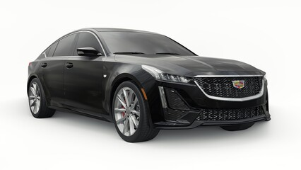

### Sedan Mercedes E

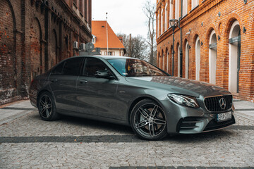

### SUV GMC Yukon

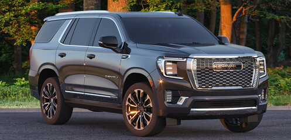

### Sedan Cadillac XTS

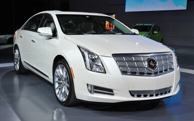

### SUV Cadillac Escalade

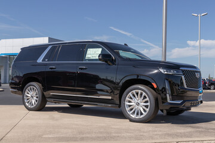

### SUV Lincoln Navigator

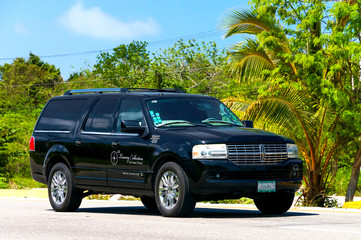

### Sedan Chrysler 300

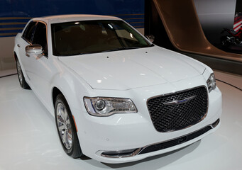

### SUV Chevrolet Suburban

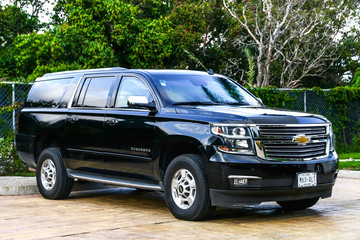

### Van Ford Transit

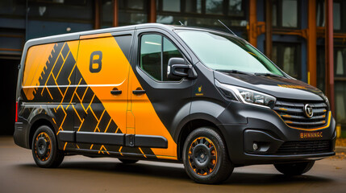

### Sedan Mercedes S

### SUV Ford Expedition

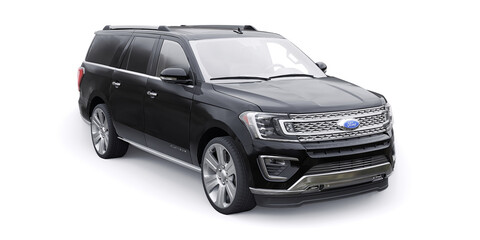

### Van Mercedes Sprinter

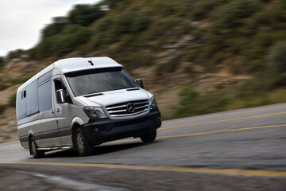
